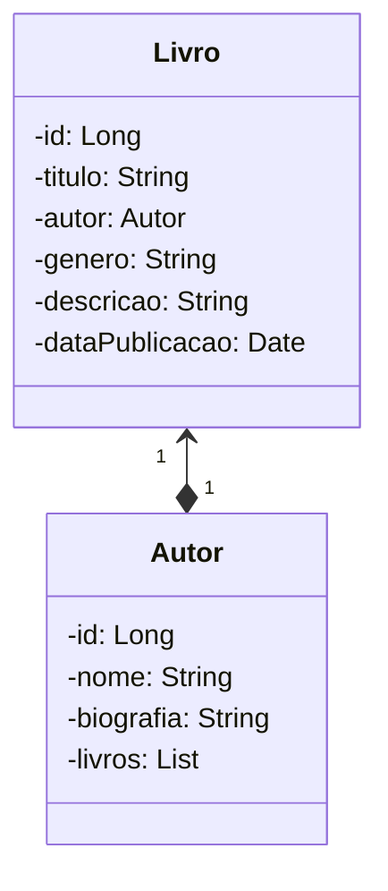

## API REST COM SPRINGBOOT

## Diagrama de Classes

```mermaid
classDiagram
    class Livro {
        -id: Long
        -titulo: String
        -autor: Autor
        -genero: String
        -descricao: String
        -dataPublicacao: Date
    }

    class Autor {
        -id: Long
        -nome: String
        -biografia: String
        -livros: List<Livro>
    }

    Livro "1" <--* "1" Autor
```
